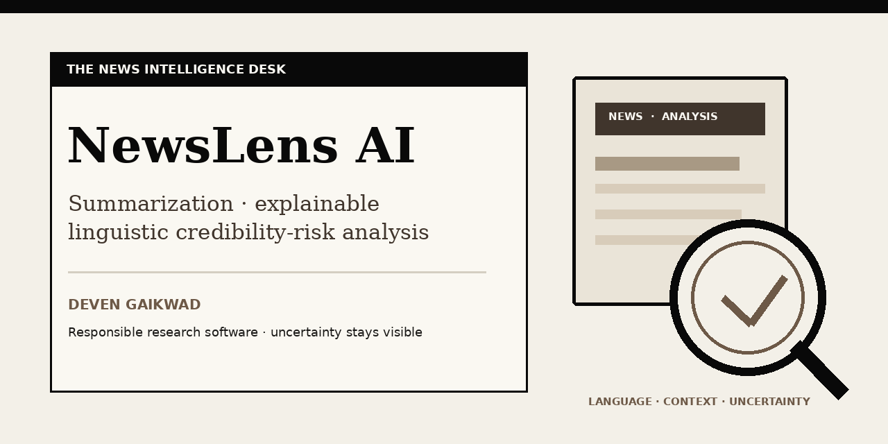
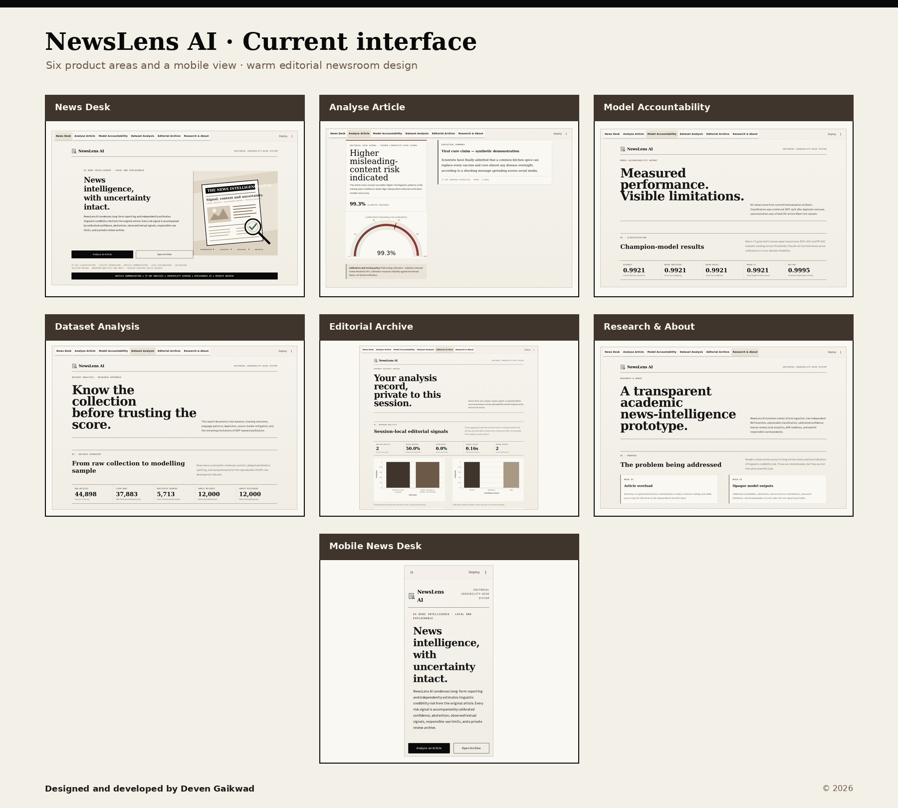
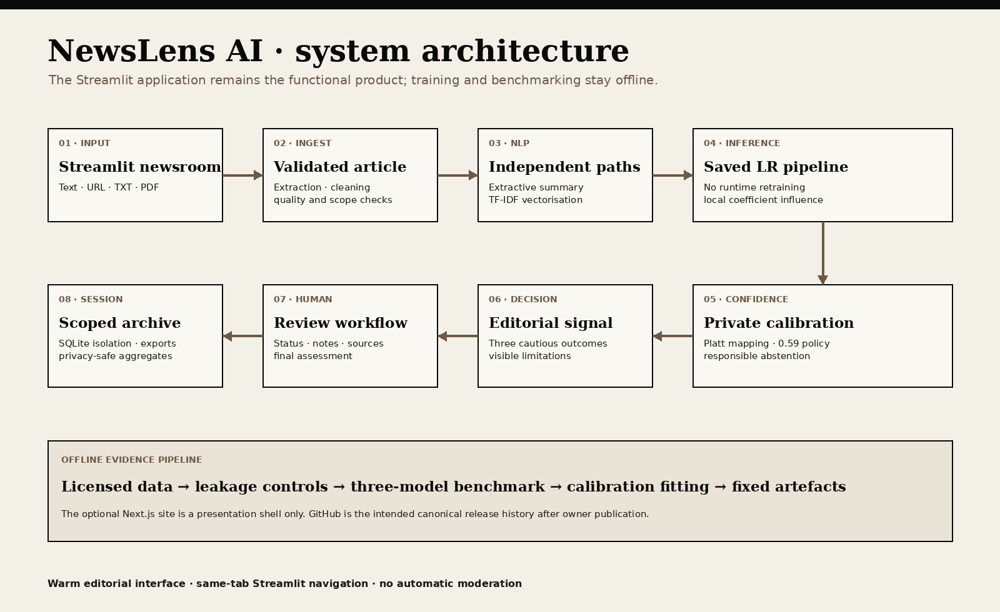
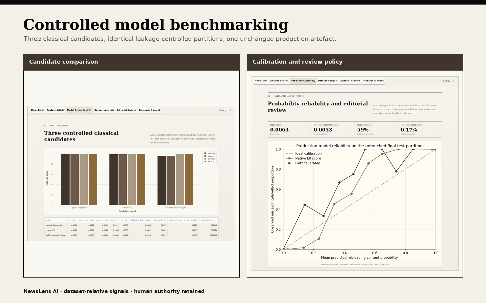
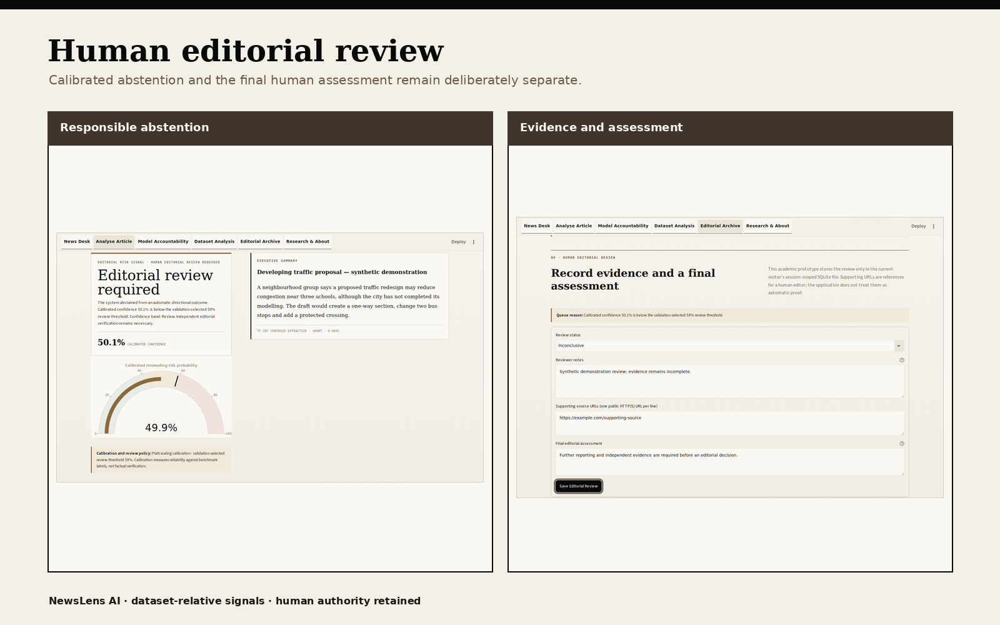
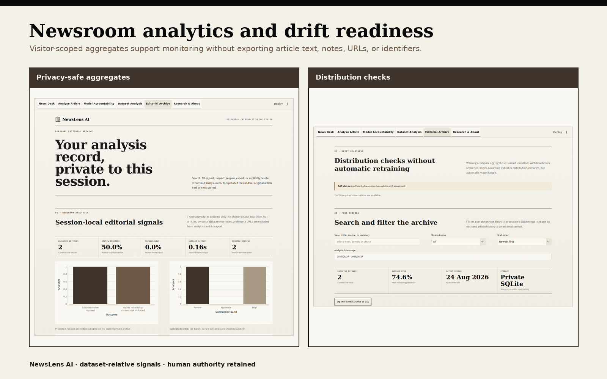

# NewsLens AI

### Explainable editorial intelligence with calibrated uncertainty and human review


[](https://github.com/DevenGaikwad/NewsLens-AI/actions/workflows/ci.yml)
[](https://github.com/DevenGaikwad/NewsLens-AI/actions/workflows/codeql.yml)




NewsLens AI is a Streamlit editorial decision-support application for article ingestion, independent summarisation, calibrated linguistic credibility-risk estimation, local model explanations, human editorial review, privacy-safe newsroom analytics, and lightweight drift readiness. It supports pasted text, public URLs, TXT, and text-based PDF inputs while keeping the functional Python/ML product separate from its optional Next.js presentation shell.

The classifier detects patterns associated with its ISOT training labels. It does not retrieve independent evidence, establish objective truth, or replace journalists and professional fact-checkers.

> This result is a machine-learning risk signal. It is not independent confirmation that an article is factually true or false.

## Project status and deployment links

| Item | Status |
|---|---|
| Local Streamlit application | Verified private runtime; 56 packaged checks and current five-width browser audit pass |
| GitHub repository | [Public source repository](https://github.com/DevenGaikwad/NewsLens-AI) published and verified on `main` |
| Public GitHub CI | 52 model-independent checks pass; 4 private-artifact checks are explicitly gated |
| Streamlit Community Cloud | Not deployed; no production URL recorded |
| Vercel Hobby presentation site | Source prepared; not deployed; current-source `npm ci`, lint, and production build pass in GitHub Actions |
| Model redistribution | Blocked pending documentary permission or applicable licence terms |
| Public release package | Source and documentation only; model and private calibration artefact excluded |

The Python/Streamlit product has passed its current private local test, integration, browser, privacy, export, and visual checks. The public repository separately compiles the Python source and runs every model-independent test while reporting the four private-artifact checks as gated. Functional public hosting remains pending the documented model-redistribution and external-service gates. The exact committed Next.js source passes dependency installation, lint, and production build in GitHub Actions. No placeholder URL is presented as a live deployment.

## Why this project matters

High-volume newsrooms must triage long articles, developing claims, community submissions, and limited review capacity. NewsLens AI explores a responsible workflow in which a model helps prioritise attention while preserving uncertainty, local explanation, and human authority. A generic regional-newsroom case study is documented in [`docs/EDITORIAL_AI_CASE_STUDY.md`](docs/EDITORIAL_AI_CASE_STUDY.md); it does not imply affiliation or endorsement by any media organisation.

## Key features

- Six same-tab Streamlit areas: News Desk, Analyse Article, Model Accountability, Dataset Analysis, Editorial Archive, and Research & About.
- Text, public-URL, TXT, and text-based PDF ingestion with bounded extraction and SSRF protections.
- Extractive TF-IDF-centroid summarisation plus an optional DistilBART path.
- Saved `isot-tfidf-lr-v1.0.0` TF-IDF + Logistic Regression model; runtime never retrains.
- Controlled comparison of Logistic Regression, Linear SVC, and Multinomial Naive Bayes on identical partitions.
- Platt confidence calibration using held-out validation-calibration rows.
- Validation-policy-selected 0.59 editorial-review threshold.
- Three responsible outcomes: `Lower misleading-content risk indicated`, `Higher misleading-content risk indicated`, and `Editorial review required`.
- Abstention for insufficient calibrated confidence and unsupported input-quality, language, length, or vocabulary conditions.
- Local signed TF-IDF-by-coefficient feature contributions.
- Session-isolated human editorial review with status, notes, public supporting-source URLs, and final assessment.
- Privacy-safe newsroom analytics for volume, risk, confidence, review, inconclusive rate, latency, model comparison, and activity.
- Drift readiness for article length, vocabulary coverage, OOV rate, predicted-class distribution, calibrated confidence, invalid input, language mismatch, and domain-support heuristics.
- JSON/PDF analysis exports, CSV archive export, and aggregate-only analytics export.
- Responsive beige/brown editorial design, visible focus states, reduced-motion support, and mobile navigation.
- Lightweight Next.js presentation shell under `web/`; no Python/ML logic is migrated to JavaScript.



## Architecture



```text
User input
   |
   +-- text / public URL / TXT / text-based PDF
   |
safe extraction and preprocessing
   |
   +---------------------------+
   |                           |
summarisation              classification
extractive / optional      saved TF-IDF + Logistic Regression
DistilBART                     |
                               +-- private Platt calibration
                               +-- validation-selected abstention
                               +-- local coefficient explanation
   |                           |
   +------------- editorial result -------------+
                                                 |
                          session-isolated SQLite review/archive
                                                 |
                             aggregate analytics and drift readiness

Offline only: dataset preparation, benchmarking, calibration fitting, evaluation.
Runtime never imports training modules and never retrains.
```

The application keeps summarisation and classification independent: the classifier receives the original cleaned article, never the generated summary. See [`docs/ARCHITECTURE.md`](docs/ARCHITECTURE.md).

## Application workflow

1. Validate text, URL, or document input.
2. Extract and clean the article while preserving useful display metadata.
3. Generate a selected-length summary through an independent branch.
4. Transform the original cleaned article with the saved training-fitted TF-IDF vectoriser.
5. Classify with the verified Logistic Regression artefact.
6. Apply held-out Platt calibration and the 0.59 validation-policy threshold.
7. Require editorial review for insufficient confidence or unsupported conditions.
8. Show calibrated confidence, input diagnostics, and local feature influence.
9. Save a visitor-scoped analysis and human review, or export portable records.
10. Summarise only privacy-safe aggregates for newsroom analytics and drift readiness.

## Controlled model benchmarking



The private evaluation reconstructs a fixed seed-42 balanced 24,000-row ISOT sample. Exact duplicates are removed before sampling. A deterministic approximate five-gram screen finds near-duplicate candidates and verifies them at Jaccard similarity at least 0.90. Two contaminated holdout rows are quarantined, and zero verified near-duplicate pairs cross the final train/validation/test partitions.

| Model | Accuracy | Macro F1 | ROC-AUC | Calibrated Brier | Calibrated ECE | Mean inference (ms/article) |
|---|---:|---:|---:|---:|---:|---:|
| Logistic Regression | 0.992080 | 0.992080 | 0.999481 | 0.006292 | 0.005295 | 0.503 |
| Linear SVC | 0.994581 | 0.994581 | 0.999851 | 0.004059 | 0.004451 | 0.614 |
| Multinomial Naive Bayes | 0.960817 | 0.960815 | 0.991564 | 0.029562 | 0.009859 | 1.315 |

Logistic Regression remains selected. Linear SVC's macro-F1 advantage is 0.002501, below the predefined 0.01 tolerance. The selected model preserves the verified production artefact, compact deployment, and direct signed-coefficient explanations. The final test contains 2,399 rows and is not used for fitting, calibration, or threshold selection.

Evidence:

- [`reports/model_benchmark_results.csv`](reports/model_benchmark_results.csv)
- [`reports/model_benchmark_summary.json`](reports/model_benchmark_summary.json)
- [`reports/model_benchmark_methodology.md`](reports/model_benchmark_methodology.md)
- [`reports/calibration_validation.json`](reports/calibration_validation.json)

## Calibration and editorial-review policy

The native Logistic Regression score is not presented as a reliable probability. Platt scaling fits a logistic mapping on 1,199 validation-calibration rows. On the untouched final test, it reduces Brier score from 0.010464 to 0.006292 and ten-bin expected calibration error from 0.044799 to 0.005295.

A separate 1,200-row validation-policy subset selects the 0.59 review threshold. The rule chooses the lowest calibrated-confidence threshold with at least 80% automatic-decision coverage and a 95% Wilson lower accuracy bound of at least 99% relative to validation labels. The final-test confidence-only review rate is 0.167%; real-session language, quality, and supported-scope checks may require additional reviews.

Calibration measures score reliability against benchmark labels, not factual verification.

## Human editorial review



Each analysis can retain these visitor-scoped fields:

- analysis identifier and timestamp;
- model outcome and calibrated confidence;
- review-required reason;
- one supported review status;
- reviewer notes;
- public supporting-source URLs;
- final editorial assessment and update timestamp.

Supported statuses are Pending review, Evidence supports the claim, Evidence contradicts the claim, Inconclusive, and Out of supported scope. The model result and human assessment remain distinct.

## Newsroom analytics and drift readiness



Analytics operate only on the current visitor's session archive. The aggregate CSV excludes article titles, summaries, full text, identifiers, notes, and URLs. Before 20 valid observations exist, the drift panel displays `Insufficient observations for a reliable drift assessment.` Warnings indicate distributional change and never trigger automatic retraining.

## Responsible-AI limitations

- The model predicts language patterns associated with ISOT labels; it does not verify claims.
- High same-dataset scores can reflect outlet, topic, period, and writing-style shortcuts.
- Calibration measures dataset-relative probability reliability, not objective truth.
- Explainability describes model influence, not journalistic evidence.
- False positives can waste review time or unfairly stigmatise writing; false negatives can create false reassurance.
- Satire, opinion, developing events, unseen publishers, adversarial paraphrases, regional formats, and future language may degrade performance.
- The packaged model supports English/Latin-script news only. Marathi and multilingual processing remain future research requiring licensed data and separately validated models.
- Human review reduces some risks but does not guarantee correctness.
- The SQLite public-safe mode is temporary and session-isolated; it is not authenticated durable enterprise storage.

See [`docs/MODEL_CARD.md`](docs/MODEL_CARD.md), [`docs/DATASET_CARD.md`](docs/DATASET_CARD.md), and [`docs/PRIVACY.md`](docs/PRIVACY.md).

## Technology stack

| Layer | Technology |
|---|---|
| Application | Python 3.12, Streamlit |
| NLP and ML | scikit-learn, TF-IDF, Logistic Regression, Linear SVC, Multinomial Naive Bayes |
| Data | pandas, NumPy |
| Explainability | direct linear TF-IDF x coefficient contributions |
| Summarisation | extractive centroid method; optional transformers/PyTorch DistilBART |
| Extraction | Requests, Trafilatura, BeautifulSoup, pypdf |
| Persistence | visitor-scoped SQLite |
| Visualisation | Plotly, Matplotlib, Seaborn |
| Exports | JSON, ReportLab PDF, formula-safe CSV |
| Presentation shell | Next.js, TypeScript, CSS |
| Verification | pytest, Streamlit AppTest, Playwright, dependency and release-policy audits |

## Repository structure

```text
NewsLens-AI/
├── app.py                    # Streamlit runtime entry point
├── pages/                    # Six native same-tab product areas
├── ui/                       # Shared editorial shell and exact design tokens
├── src/                      # Inference, calibration, diagnostics, review, analytics, exports
├── models/                   # Private local model/calibration artefacts plus metadata
├── training/                 # Offline data, benchmark, calibration, and evaluation workflows
├── database/                 # Schema guidance; generated activity databases ignored
├── data/sample/              # Original synthetic demonstration articles
├── assets/github/            # Repository presentation images
├── reports/                  # Aggregate measured evidence, figures, screenshots, QA records
├── tests/                    # Unit, integration, security, UI, privacy, and release contracts
├── docs/                     # Public guides, cards, report, case study, interview guide
├── scripts/                  # Verification, audits, captures, and document builders
└── web/                      # Lightweight Next.js/Vercel presentation shell only
```

## Installation

Prerequisites: Python 3.12 and a private copy of the verified model plus matching calibration artefact. Public archives intentionally exclude both artefacts.

```bash
git clone https://github.com/DevenGaikwad/NewsLens-AI.git
cd NewsLens-AI
python -m venv .venv
```

Activate the environment:

```bash
# macOS / Linux
source .venv/bin/activate

# Windows PowerShell
.venv\Scripts\Activate.ps1
```

Install the deployment-compatible core:

```bash
python -m pip install --upgrade pip
python -m pip install -r requirements-lite.txt
```

Install optional abstractive summarisation dependencies only when needed:

```bash
python -m pip install -r requirements.txt
```

`requirements.txt` includes the root deployment dependency path through `requirements-lite.txt`; it does not change application logic.

## Local execution

Place the privately approved artefacts at:

```text
models/fake_news_pipeline.joblib
models/confidence_calibration.json
```

Then run:

```bash
streamlit run app.py
```

The application uses session-isolated temporary history by default. `NEWSLENS_HISTORY_MODE=persistent` is only for a trusted, single-user local runtime.

## Testing and verification

```bash
python -m pytest -q
python scripts/verify_project.py
python scripts/audit_public_release.py --allow-publication-gates
```

The controlled benchmark requires checksum-verified official ISOT CSVs in a private directory:

```bash
python training/benchmark_models.py --raw-dir /private/path/to/isot
```

Raw dataset files are never added to release archives. Final test, compilation, Streamlit, dependency, Next.js, browser-width, documentation, and archive results are recorded in [`docs/DEPLOYMENT_CHECKPOINT.md`](docs/DEPLOYMENT_CHECKPOINT.md) and [`reports/NewsLens_AI_Deployment_and_Audit_Report.md`](reports/NewsLens_AI_Deployment_and_Audit_Report.md).

## Security and privacy

- Public URL ingestion validates every redirect and blocks local/private network access.
- Upload and extraction size limits prevent unbounded processing.
- Formula-safe CSV and escaped PDF rendering reduce export injection risk.
- Secrets, local paths, runtime logs, uploads, generated databases, and private artefacts are ignored and excluded from public archives.
- Public-safe history uses a non-guessable session-scoped temporary SQLite path.
- No paid API, hosted database, background job, or runtime retraining is required.

Report security issues through [`SECURITY.md`](SECURITY.md). See [`docs/PRIVACY.md`](docs/PRIVACY.md) for the storage boundary.

## Documentation

- [Project report (DOCX)](docs/NewsLens_AI_Project_Report.docx)
- [Project report (PDF)](docs/NewsLens_AI_Project_Report.pdf)
- [Setup and run guide](docs/NewsLens_AI_Setup_and_Run_Guide.docx)
- [Code explanation and developer guide](docs/NewsLens_AI_Code_Explanation_and_Developer_Guide.docx)
- [Concepts, methodologies, and terminology guide](docs/NewsLens_AI_Complete_Concepts_Methodologies_and_Terminology_Guide.docx)
- [Research paper matrix](docs/NewsLens_AI_Research_Paper_Matrix.xlsx)
- [Editorial AI case study](docs/EDITORIAL_AI_CASE_STUDY.md)
- [Placement interview guide](docs/PLACEMENT_INTERVIEW_GUIDE.md)
- [Architecture](docs/ARCHITECTURE.md)
- [Model card](docs/MODEL_CARD.md)
- [Dataset card](docs/DATASET_CARD.md)
- [Testing](docs/TESTING.md)
- [Deployment](docs/DEPLOYMENT.md)
- [Privacy](docs/PRIVACY.md)
- [Third-party licences](docs/THIRD_PARTY_LICENSES.md)
- [Public release audit](docs/PUBLIC_RELEASE_AUDIT.md)

## Deployment architecture

```text
Public GitHub repository
        |
        +-- Streamlit Community Cloud (free tier)
        |      +-- app.py Python/ML runtime
        |
        +-- Vercel Hobby at zero base price
               +-- web/ Next.js presentation shell
               +-- /app iframe using NEXT_PUBLIC_STREAMLIT_APP_URL + ?embed=true
```

NewsLens AI is designed for a zero-cost academic deployment architecture based on a public GitHub repository, Streamlit Community Cloud for the Python application, and Vercel Hobby for the presentation website. Hosting remains subject to providers' current free-tier limits and non-commercial-use conditions. No payment, paid trial, custom domain, paid database, paid analytics, or billable overage is authorised.

Functional deployment must not proceed until the model/calibration redistribution gate is resolved. The Next.js shell must not be represented as the complete ML application without a working Streamlit runtime.

## Future roadmap

- Licensed Marathi and multilingual regional-news corpora with language-specific preprocessing and calibration.
- Publisher-, event-, topic-, and time-separated evaluation.
- Authenticated editorial roles and encrypted managed persistence when an approved architecture exists.
- Human-review agreement and explanation-usefulness studies.
- Separately evaluated claim/evidence retrieval rather than treating linguistic classification as fact-checking.
- Monitoring ownership, alert policy, model-card updates, and deliberate human-approved retraining.

## Author, citation, and rights

Designed and developed by **Deven Sachin Gaikwad**.

Preferred citation metadata is in [`CITATION.cff`](CITATION.cff). Repository publication is intended at <https://github.com/DevenGaikwad/NewsLens-AI> after the documented repository and model-rights gates clear.

© 2026 Deven Sachin Gaikwad. All Rights Reserved.

The original project components are proprietary and source-visible; [`LICENSE`](LICENSE) is explicitly not an open-source licence. Third-party packages, datasets, papers, and tools retain their own terms. Public visibility does not grant permission to copy, redistribute, sell, sublicense, or submit this project as another person's work.
