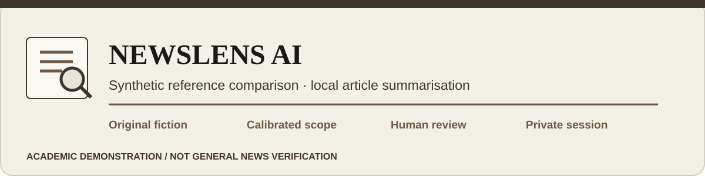
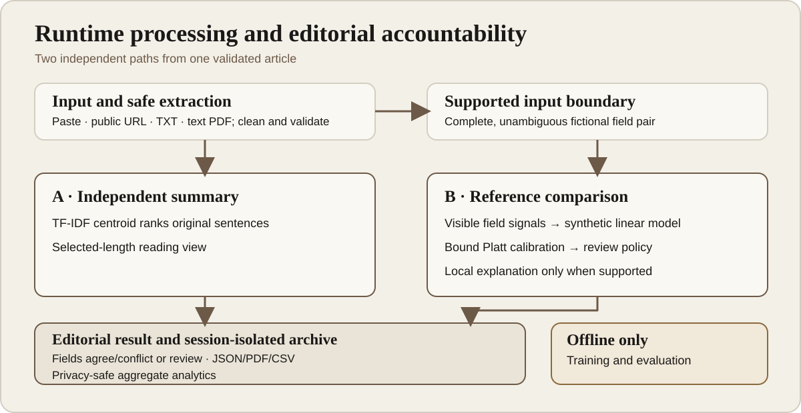
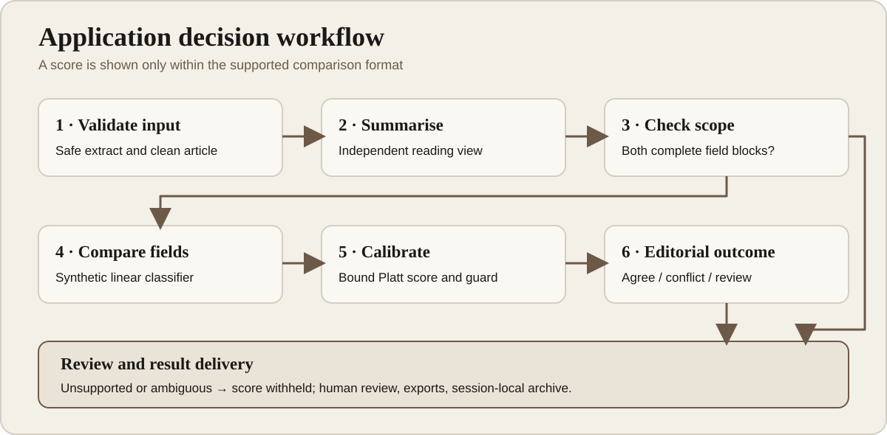
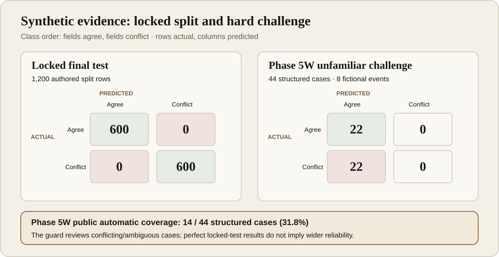
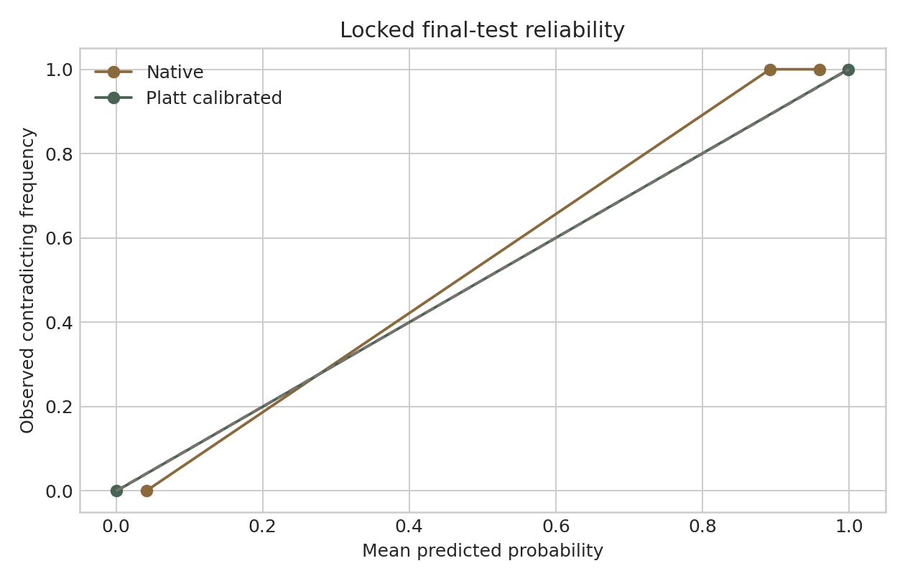

# NewsLens AI

**Summarise an article. Compare its visible fictional reference fields. Keep editorial judgment in human hands.**

[](https://github.com/DevenGaikwad/NewsLens-AI/actions/workflows/ci.yml)
[](https://github.com/DevenGaikwad/NewsLens-AI/actions/workflows/codeql.yml)


NewsLens AI is a noncommercial student and internship-portfolio demonstration by **Deven Sachin Gaikwad**. It combines deterministic extractive summarisation with an explainable classifier trained exclusively on an independently authored synthetic benchmark.

The **Reference comparison** classifier has a deliberately narrow purpose: compare the visible `Reference note` and `Article account` fields in the supported fictional format and indicate whether their ledgers are consistent or contradicting. It is **not** a general fake-news detector and does not establish real-world truth. A separate general-news screening model is not deployed; its candidate data have not passed the licensing and task-fit gate described in the [deployment/model license audit](docs/PUBLIC_DEPLOYMENT_MODEL_LICENSE_AUDIT.md).

**Live application:** [newslens-ai-devengaikwad.streamlit.app](https://newslens-ai-devengaikwad.streamlit.app/). Check the deployed commit before using a live screen as release evidence.

## Application at a glance

| Page | Purpose |
|---|---|
| News Desk | Introduces the supported task, scope, and route into the application. |
| Analyse Article | Accepts pasted text, a public URL, TXT, or a text-based PDF; shows a summary, Reference comparison, explanation, review status, and exports. |
| Model Accountability | Presents the synthetic benchmark evaluation and model limits. |
| Dataset Analysis | Describes the independently authored synthetic corpus and its evaluation profile. |
| Editorial Archive | Keeps review records within a visitor session and offers aggregate monitoring and CSV export. |
| Research & About | Explains authorship, evidence, responsible use, and project context. |



The [detailed vertical architecture](assets/github/runtime-processing-editorial-accountability.svg) is retained for closer inspection.

### Application decision workflow



The summary uses selected source sentences. The classifier uses the original cleaned article; its scores compare the supplied fictional fields and never certify external facts. Ordinary unsupported prose is routed to human review.

## Capabilities and scope

| Path | What users receive | Boundary |
|---|---|---|
| Independent reading summary | Original sentences ranked by a local TF-IDF centroid. | The summary does not verify the source. |
| Supported fictional comparison | A fields-agree outcome when the paired fields agree and the model passes its review policy; an explanation and bound calibrated score. | The frozen model can miss unfamiliar single-field conflicts, so a visible disagreement against its agreement prediction is routed to review with the directional score withheld. |
| Missing, repeated, malformed, or ordinary prose | A reading summary and a human-review explanation. | No public real/fake or directional comparison probability. |
| Editorial record | JSON/PDF export, session-isolated archive, CSV review export, and privacy-safe aggregate indicators. | Full submitted article text is not retained in the archive. |

## Public dataset and model

- 24,000 original synthetic articles representing 12,000 fictional paired events.
- Deterministic generator, manifest, audit evidence, and reproducibility tests.
- Event-grouped five-way splits keep paired accounts of an event together.
- TF-IDF bigram + Logistic Regression public model.
- Platt calibration cryptographically bound to the exact model SHA-256.
- Group-safe training, validation, calibration, abstention-policy, and locked-test partitions.
- Streamlit interface with summarisation, classification, abstention, explanations, exports, session-local review, and aggregate monitoring.

All training articles and entities were independently authored for this project. No external copyrighted article dataset or non-redistributable model/calibration artifact is included.

The dataset contains only invented articles and entities; the model never uses private ISOT-derived content or artifacts. The released model is the frozen **v1.0.0** package. A bounded Phase 5X relational-feature candidate was rejected because automatic coverage missed a predeclared independent gate; no replacement model, calibration, or dataset was released. The [candidate gate and confirmation report](docs/PHASE5X_MODEL_GATE.md) explain the result.

## Measured evidence



The matrices have **actual rows** and **predicted columns**, ordered fields agree then fields conflict. The left is the authored **1,200-row final test**; the right is an exploratory **44-case unfamiliar structured challenge**. They estimate different conditions and should never be combined into one accuracy claim.

| Evidence | Locked synthetic final test | Phase 5W unfamiliar challenge |
|---|---:|---:|
| Structured cases | 1,200 | 44 |
| Class order / confusion matrix | Agree, conflict / `[[600, 0], [0, 600]]` | Agree, conflict / `[[22, 0], [22, 0]]` |
| Balanced accuracy / macro F1 | 1.000 / 1.000 | 0.500 / 0.333 (raw model) |
| Conflict recall | 1.000 | 0.000 (raw model) |
| Automatic coverage | 100% | 14/44 (31.8%) with PR #52 guard |
| Calibration | Brier 0.000001497; ten-bin ECE 0.000742 | Not estimable on the one-class automatically reported subset |

The locked-test counterfactual account-swap flip rate was 100%; surface-text-only and fact-block-ablated balanced accuracy were 0.500 and 0.498, respectively, while metadata-only balanced accuracy was 0.521. These are authored-benchmark controls, not unrestricted news validation.



Perfect in-distribution performance reflects a structured synthetic comparison task; it must not be interpreted as unrestricted news-veracity performance. A separate, independently authored [Phase 5W challenge](docs/PHASE5W_CHALLENGE_AND_ROUTING.md) found that the frozen model missed single-field conflicts in unfamiliar fictional examples. The runtime now requests review and withholds scores when its agreement prediction conflicts with a visible field difference. This safety routing does not improve the frozen model's discrimination.

The sealed Phase 5X confirmation used **12 other fictional events** (24 agreements, 24 conflicts, 12 review cases). One experimental relational-feature candidate classified all 48 structured cases but automatically reported only 36/48 (75%), below its predeclared 80% coverage gate. The candidate was rejected; those numbers describe an **unreleased experiment**, not the public application. [Detailed method and limits](docs/PHASE5X_MODEL_GATE.md).

## Understanding the calibrated probabilities

- **Fields agree - calibrated probability** is the calibrated probability of the synthetic `ledger-consistent` class learned from visible `Reference note` and `Article account` comparison patterns.
- **Fields conflict - calibrated probability** is the calibrated probability of the synthetic `ledger-contradicting` class learned from those same visible fields.
- **Reference-comparison confidence** is the calibrated confidence in the selected synthetic consistency class. It is not factual certainty.
- Inputs without a complete, unambiguous structured pair, or with a model agreement score that conflicts with a visible field difference, require human review. Directional probabilities are withheld in the UI, PDF, and archive CSV. JSON retains its diagnostic fields with an explicit `score_reporting_status` for compatibility; those internal values are not public credibility scores.

These scores measure agreement with the synthetic benchmark classes. They do not determine whether a real-world article is true or fake.

## Faculty demonstration samples

On **Analyse Article**, choose **Paste text**, select a **Fictional demonstration sample**, click **Load Selected Sample**, then **Analyse Article**. The packaged fields-agree and fields-conflict examples demonstrate the two supported outcomes. The ordinary-prose sample demonstrates review with public directional scores withheld. A *different unfamiliar single-field conflict* can also be routed to review when the frozen model misses its visible difference. See the [sample guide](data/sample/README.md); do not interpret either output as independent fact-checking.

## Technology stack

| Layer | Components |
|---|---|
| Interface and local processing | Streamlit, Python 3.12, article extraction and deterministic TF-IDF centroid summary |
| Public model | scikit-learn TF-IDF bigrams + Logistic Regression, authored synthetic comparison signals |
| Confidence and decisions | Model-bound Platt calibration, validation-selected threshold, conservative scope guard |
| Explainability and output | Local linear contributions, ReportLab PDF, JSON, SQLite session archive and CSV |
| Evidence and release | Event-grouped synthetic benchmark, reproducibility manifest, pytest, GitHub Actions and CodeQL |

## Quick start

Use Python 3.12. From the repository root on macOS/Linux:

```bash
python3.12 -m venv .venv
source .venv/bin/activate
python -m pip install -r requirements-lite.txt
python -m streamlit run app.py
```

On Windows PowerShell:

```powershell
py -3.12 -m venv .venv
.\.venv\Scripts\Activate.ps1
python -m pip install -r requirements-lite.txt
python -m streamlit run app.py
```

No API key or secret is required. The packaged model and calibration are loaded from `models/` without runtime training.

## Reproduce the model package

The authoritative dataset archive is already versioned. The following command verifies its identity, trains on the authored training split, selects only on model validation, fits calibration, selects the abstention policy, and evaluates the locked final test once:

```bash
python training/train_synthetic_model.py
```

The accepted public artifacts are described in `models/public_artifact_manifest.json`. Re-running training in a materially different dependency environment can change serialized bytes; publication uses the recorded artifacts and hashes.

## Validate

```bash
python -m compileall -q app.py pages src ui tests scripts training synthetic_benchmark
python -m pytest -q --strict-markers
python scripts/audit_public_release.py --tracked-files
```

The release scan verifies the dataset ZIP, public model, calibration binding, legal package, secrets, private artifact exclusions, navigation, local links, and resolved deployment URL.

## Repository map

| Location | Contents |
|---|---|
| `app.py`, `pages/`, `ui/` | Six-page Streamlit application and editorial design system. |
| `src/` | Safe extraction, preprocessing, summary, prediction, calibration, diagnostics, exports, and session records. |
| `synthetic_benchmark/`, `scripts/`, `training/` | Authored generator, audited signals, reproducibility and bounded offline studies. |
| `data/synthetic/`, `models/` | Versioned public synthetic archive, frozen model, bound calibration, and artifact manifest. |
| `docs/`, `reports/`, `tests/` | Dataset/model cards, guides, numerical evidence, figures, and regression checks. |

## Deployment evidence

- Streamlit Community Cloud workspace: `devengaikwad`
- Repository / branch / entry point: `DevenGaikwad/NewsLens-AI` / `main` / `app.py`
- Python: 3.12; secrets: empty; paid features: none
- PR B: [#45](https://github.com/DevenGaikwad/NewsLens-AI/pull/45)
- Validated PR B head: `56f6e3e7137bd03fe45a0cd3e88978588968cdd1`
- Model merge: `214b22745736b25f4c1121822a1811c76687bb00`; tree: `093cdbacf815be22791ae73bf5a581a9e84edd3d`
- Recorded release smoke checks covered startup, all six pages, summary, both classifier labels, abstention, invalid input, explanations, JSON/PDF/CSV controls, session isolation, and public access. The [deployment report](docs/DEPLOYMENT.md) records the release evidence; the live deployment's commit must be checked separately when verifying its current interface.
- Vercel was intentionally not deployed.

## Responsible use

- Inputs lacking a complete, unambiguous supported comparison, and inputs whose visible field difference conflicts with the model's agreement score, are routed to review with public scores withheld.
- Calibrated class probabilities and reference-comparison confidence are displayed only for supported structured comparisons; they measure synthetic benchmark-class agreement, not factual truth.
- The app does not expose raw training rows.
- Public history is isolated to a visitor session; full article text is not persisted.
- Human verification against independent primary sources remains necessary.

## Documentation and rights

| Read next | Purpose |
|---|---|
| [Dataset card](docs/DATASET_CARD.md) · [dataset package guide](data/synthetic/README.md) | Fictional provenance, split design, package identity, and dataset license. |
| [Model card](docs/MODEL_CARD.md) · [testing guide](docs/TESTING.md) | Model objectives, limits, metrics, and validation paths. |
| [Phase 5W challenge](docs/PHASE5W_CHALLENGE_AND_ROUTING.md) · [Phase 5X candidate gate](docs/PHASE5X_MODEL_GATE.md) | Unfamiliar-case failure, safety routing, and unreleased candidate decision. |
| [Setup guide](docs/NewsLens_AI_Setup_and_Run_Guide.docx) · [deployment guide](docs/DEPLOYMENT.md) | Local installation and published deployment evidence. |
| [Security policy](SECURITY.md) · [contributing guide](CONTRIBUTING.md) | Reporting and project contribution practices. |

© 2026 Deven Sachin Gaikwad. All Rights Reserved. The synthetic dataset has the separate license described in its dataset card.
