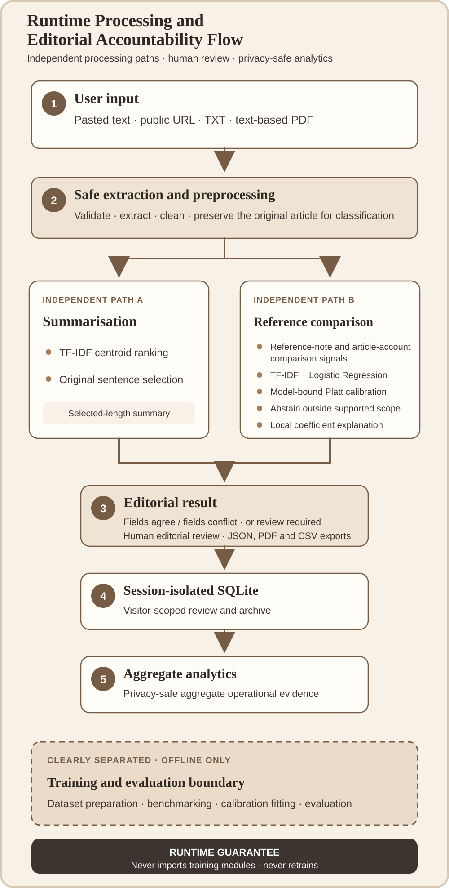
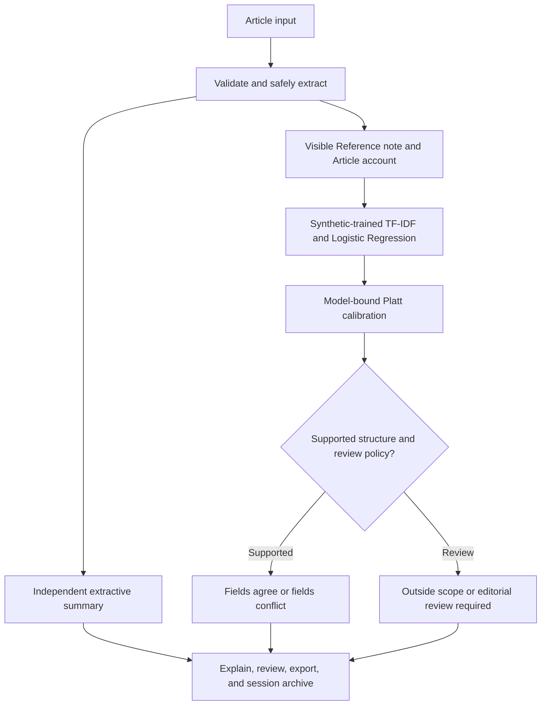

# NewsLens AI

**Summarise an article, compare its visible fictional reference fields, and keep editorial judgment in human hands.**

[](https://github.com/DevenGaikwad/NewsLens-AI/actions/workflows/ci.yml)
[](https://github.com/DevenGaikwad/NewsLens-AI/actions/workflows/codeql.yml)


NewsLens AI is a noncommercial student and placement-portfolio demonstration built by **Deven Sachin Gaikwad**. It combines deterministic extractive summarisation with an explainable classifier trained exclusively on an independently created synthetic benchmark.

The **Reference comparison** classifier has a deliberately narrow purpose: compare the visible `Reference note` and `Article account` fields in the supported fictional format and indicate whether their ledgers are consistent or contradicting. It is **not** a general fake-news detector and does not establish real-world truth. A separate general-news screening model is not deployed; its candidate data have not passed the licensing and task-fit gate described in the [deployment/model license audit](docs/PUBLIC_DEPLOYMENT_MODEL_LICENSE_AUDIT.md).

**Live application:** [newslens-ai-devengaikwad.streamlit.app](https://newslens-ai-devengaikwad.streamlit.app/)

## Application at a glance

| Page | Purpose |
|---|---|
| News Desk | Introduces the supported task, scope, and route into the application. |
| Analyse Article | Accepts pasted text, a public URL, TXT, or a text-based PDF; shows a summary, Reference comparison, explanation, review status, and exports. |
| Model Accountability | Presents the synthetic benchmark evaluation and model limits. |
| Dataset Analysis | Describes the independently authored synthetic corpus and its evaluation profile. |
| Editorial Archive | Keeps review records within a visitor session and offers aggregate monitoring and CSV export. |
| Research & About | Explains authorship, evidence, responsible use, and project context. |



### Application decision workflow


```mermaid
flowchart TD
    A["Article input"] --> B["Validate and safely extract"]
    B --> C["Independent extractive summary"]
    B --> D["Visible Reference note and Article account"]
    D --> E["Synthetic-trained TF-IDF and Logistic Regression"]
    E --> F["Model-bound Platt calibration"]
    F --> G{"Supported structure and review policy?"}
    G -- "Supported" --> H["Fields agree or fields conflict"]
    G -- "Review" --> I["Outside scope or editorial review required"]
    C --> J["Explain, review, export, and session archive"]
    H --> J
    I --> J
```

The summary uses selected source sentences. The classifier uses the original cleaned article; its scores compare the supplied fictional fields and never certify external facts. Ordinary unsupported prose is routed to human review.

## What is public

- 24,000 original synthetic articles representing 12,000 fictional paired events.
- Deterministic generator, manifest, audit evidence, and reproducibility tests.
- Event-grouped five-way splits keep paired accounts of an event together.
- TF-IDF bigram + Logistic Regression public model.
- Platt calibration cryptographically bound to the exact model SHA-256.
- Group-safe training, validation, calibration, abstention-policy, and locked-test partitions.
- Streamlit interface with summarisation, classification, abstention, explanations, exports, session-local review, and aggregate monitoring.

All training articles and entities were independently authored for this project. No external copyrighted article dataset or non-redistributable model/calibration artifact is included.


## Measured evidence

| Measure | Result |
|---|---:|
| Locked final-test rows | 1,200 |
| Accuracy / balanced accuracy / macro F1 | 1.000 / 1.000 / 1.000 |
| Confusion matrix | `[[600, 0], [0, 600]]` |
| Platt Brier score | 0.000001497 |
| Expected calibration error | 0.000742 |
| Counterfactual account-swap flip rate | 100% |
| Surface-text-only balanced accuracy | 0.500 |
| Fact-block ablation balanced accuracy | 0.498 |
| Metadata-only balanced accuracy | 0.521 |

Perfect in-distribution performance reflects a structured synthetic comparison task; it must not be interpreted as unrestricted news-veracity performance. A separate, independently authored [Phase 5W challenge](docs/PHASE5W_CHALLENGE_AND_ROUTING.md) found that the frozen model missed single-field conflicts in unfamiliar fictional examples. The runtime now requests review and withholds scores when its agreement prediction conflicts with a visible field difference. This safety routing does not improve the frozen model's discrimination.

## Understanding the calibrated probabilities

- **Fields agree - calibrated probability** is the calibrated probability of the synthetic `ledger-consistent` class learned from visible `Reference note` and `Article account` comparison patterns.
- **Fields conflict - calibrated probability** is the calibrated probability of the synthetic `ledger-contradicting` class learned from those same visible fields.
- **Reference-comparison confidence** is the calibrated confidence in the selected synthetic consistency class. It is not factual certainty.
- Inputs without a complete, unambiguous structured pair, or with a model agreement score that conflicts with a visible field difference, require human review. Directional probabilities are withheld in the UI, PDF, and archive CSV. JSON retains its diagnostic fields with an explicit `score_reporting_status` for compatibility; those internal values are not public credibility scores.

These scores measure agreement with the synthetic benchmark classes. They do not determine whether a real-world article is true or fake.

## Faculty demonstration samples

On **Analyse Article**, choose **Paste text**, select one of the three **Fictional demonstration sample** options, click **Load Selected Sample**, then **Analyse Article**. The options show fields-agree, fields-conflict, and ordinary-prose review paths. The [sample guide](data/sample/README.md) explains what each one demonstrates. Use fictional inputs; an external news article without the required comparison fields is routed to review, not given a real/fake verdict.

## Run locally

Python 3.12 is the deployment target.

```bash
python -m venv .venv
source .venv/bin/activate
python -m pip install -r requirements-lite.txt
python -m streamlit run app.py
```

On Windows PowerShell, activate with `.venv\Scripts\Activate.ps1`.

No API key or secret is required. The packaged model and calibration are loaded from `models/` without runtime training.

## Reproduce the model package

The authoritative dataset archive is already versioned. The following command verifies its identity, trains on the authored training split, selects only on model validation, fits calibration, selects the abstention policy, and evaluates the locked final test once:

```bash
python training/train_synthetic_model.py
```

The accepted public artifacts are described in `models/public_artifact_manifest.json`. Re-running training in a materially different dependency environment can change serialized bytes; publication uses the recorded artifacts and hashes.

## Validate

```bash
python -m compileall -q app.py pages src ui tests scripts training synthetic_benchmark
python -m pytest -q --strict-markers
python scripts/audit_public_release.py --tracked-files
```

The release scan verifies the dataset ZIP, public model, calibration binding, legal package, secrets, private artifact exclusions, navigation, local links, and resolved deployment URL.

## Deployment evidence

- Streamlit Community Cloud workspace: `devengaikwad`
- Repository / branch / entry point: `DevenGaikwad/NewsLens-AI` / `main` / `app.py`
- Python: 3.12; secrets: empty; paid features: none
- PR B: [#45](https://github.com/DevenGaikwad/NewsLens-AI/pull/45)
- Validated PR B head: `56f6e3e7137bd03fe45a0cd3e88978588968cdd1`
- Model merge: `214b22745736b25f4c1121822a1811c76687bb00`; tree: `093cdbacf815be22791ae73bf5a581a9e84edd3d`
- Recorded release smoke checks covered startup, all six pages, summary, both classifier labels, abstention, invalid input, explanations, JSON/PDF/CSV controls, session isolation, and public access. The [deployment report](docs/DEPLOYMENT.md) records the release evidence; the live deployment's commit must be checked separately when verifying its current interface.
- Vercel was intentionally not deployed.

## Responsible use

- Inputs lacking a complete, unambiguous supported comparison, and inputs whose visible field difference conflicts with the model's agreement score, are routed to review with public scores withheld.
- Calibrated class probabilities and reference-comparison confidence are displayed only for supported structured comparisons; they measure synthetic benchmark-class agreement, not factual truth.
- The app does not expose raw training rows.
- Public history is isolated to a visitor session; full article text is not persisted.
- Human verification against independent primary sources remains necessary.

See `docs/DATASET_CARD.md`, `docs/MODEL_CARD.md`, `docs/TESTING.md`, and `docs/DEPLOYMENT.md` for the full evidence trail.

© 2026 Deven Sachin Gaikwad. All Rights Reserved. The synthetic dataset has the separate license described in its dataset card.
