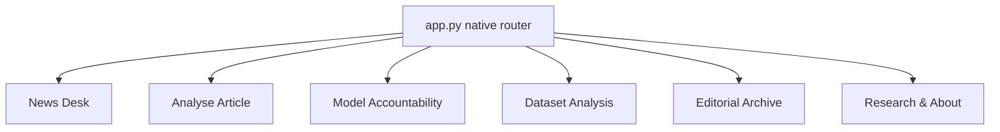
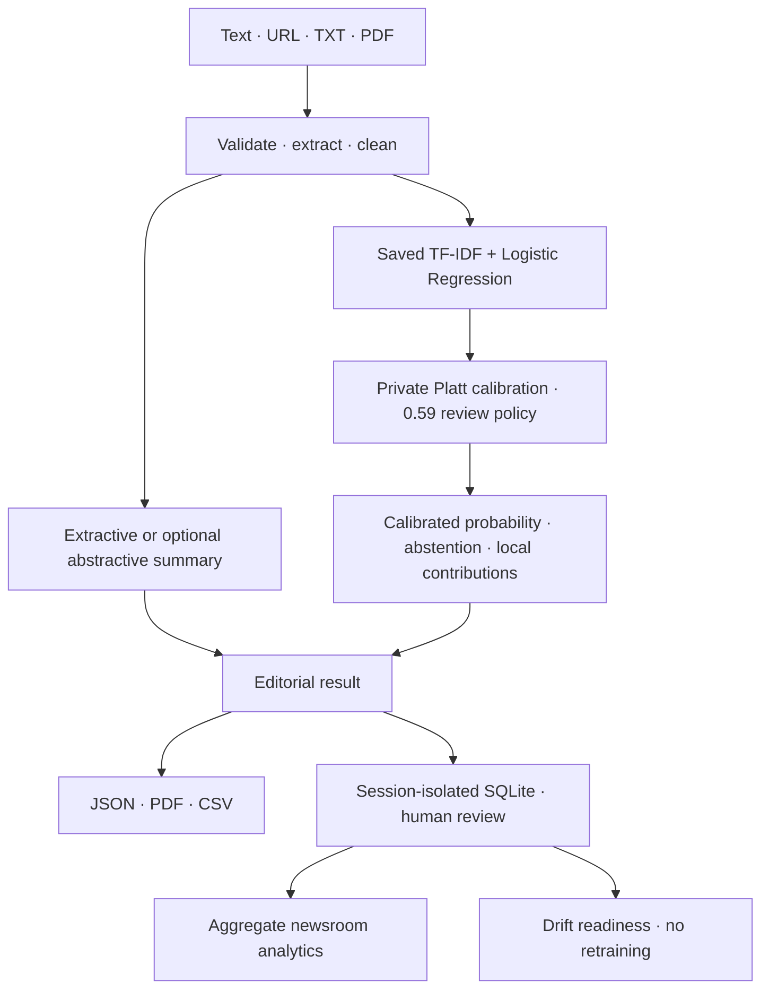
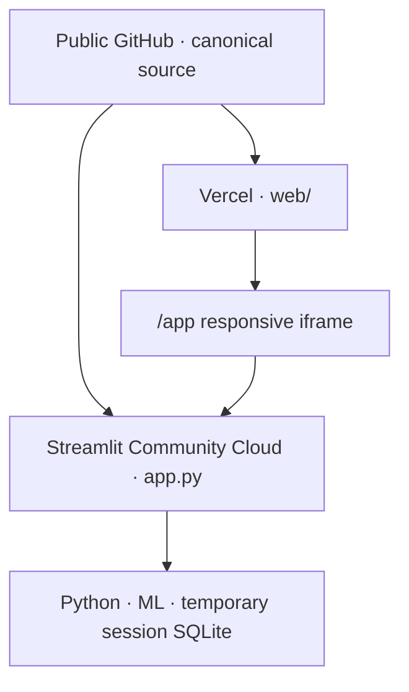

# NewsLens AI architecture

## Runtime boundary

`app.py` is the only Streamlit entrypoint. It registers the six source files with `st.Page` and runs `st.navigation(position="top")`. Internal calls to action use `st.page_link`; no internal route requires raw HTML anchors, `window.open`, link buttons to internal URLs or a second tab.

The Streamlit layer orchestrates reusable modules under `src/`; it does not own the ML implementation and never retrains the model.

## Analysis flow

The classifier consumes the original cleaned article. Summary text never feeds the classifier.

## Storage and privacy

`src/database.py` remains path-parameterized. `src/session_history.py` selects the path:

- `NEWSLENS_HISTORY_MODE=session` is the default and fail-closed behavior. A random session token is SHA-256 hashed into a temporary SQLite filename.
- `NEWSLENS_HISTORY_MODE=persistent` selects `NEWSLENS_DATABASE_PATH` and is intended only for a trusted, single-user local runtime.

This prevents one public visitor from listing another visitor's archive. Review notes and supporting-source URLs remain inside the same scope. Analytics and drift use aggregate fields and do not export full articles, notes, URLs, or identifiers. The design does not make SQLite encrypted or durable on Streamlit Community Cloud.

## Public hosting

The Next.js website is a presentation shell only. It contains no classifier, summariser, SQLite implementation, explanation logic or export pipeline.

The shell accepts one browser-exposed value,
`NEXT_PUBLIC_STREAMLIT_APP_URL`, and validates it as a bare HTTPS
`*.streamlit.app` origin. Production responses stage a CSP whose `frame-src` is
that validated origin, standard security headers, and a sandboxed iframe that
retains only the scripts/forms/downloads/popups required by the embedded product.

Public hosting remains blocked until the packaged-model and dataset-derived
calibration redistribution decision is resolved; removing those private artefacts
makes the preserved calibrated classifier unavailable.
